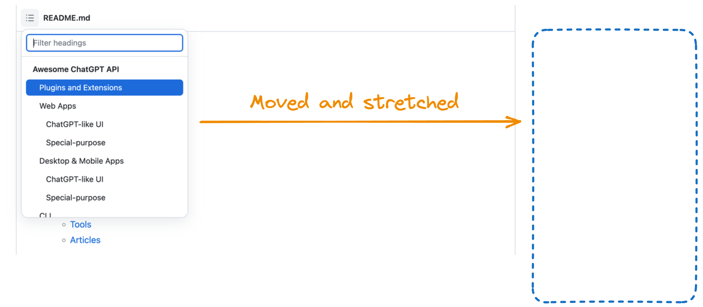

# GitHub TOC Sidebar

Show GitHub README TOC as a sidebar 

This is how it works:

Install it on [Chrome Web Store](https://chrome.google.com/webstore/detail/github-toc-sidebar/cdiiikhamhampcninkmmpgejjbgdgdnn)

## Features

- Automatically display the native README TOC on the right side while scrolling down.
- Hide the README TOC after the sidebar shows up when you scroll up

> **Notes**
> 1. This extension is designed solely to enhance the browsing experience for GitHub README.
>     If you need a universal TOC extension, please refer to other options such as Smart TOC or Simple Outliner.
> 2. This extension utilizes the native README TOC provided by GitHub,
>    which makes it look beautiful and easy to implement.

## Configuration

I haven't added any configurations since it totally fulfills my need.
However, I have considered options such as being able to customize the width and height of the TOC,
or even making it movable.

If you would like to suggest and contribute these features,
please feel free to send a pull request or create a detailed issue explaining your requirements and design suggestions.
